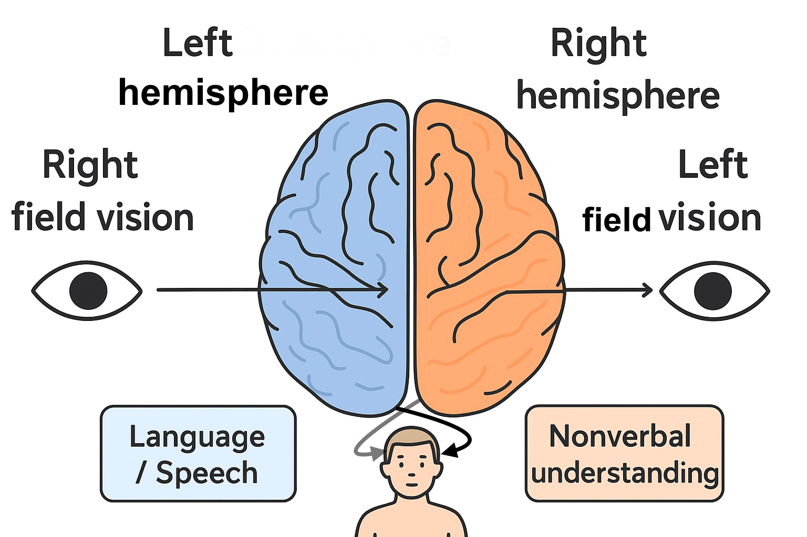

+++
title = 'Split Brain Experiment and Consciousness'
date = 2025-08-23T22:26:30+02:00
draft = false
+++

In this article we will explore the split brain experiment and its findings. We will also delve into a thought experiment about consciousness. 

## History
Since the 1940s, patients with severe epilepsy have been treated surgically by cutting corpus callosum in their brain, which is a thick bundle of nerve fibers connecting the brain’s two hemispheres (left and right). Since corpus callosum enabled both the hemispheres to communicate with each other, cutting this pathway means disabling this communication and thereby preventing seizures from spreading from one hemisphere to the other. 

Split brain experiment was conducted in the 1960s and 1970s by scientist and psychologist Roger Sperry and Michael Gazzaniga. They were curious to understand how the two hemispheres work when separated (like in the case of treating severe epilepsy) and what each hemisphere controls. They presented visual or tactile stimuli to one hemisphere at a time and recorded patients responses verbally and via actions. 

## The Outcome
One of the major findings of this experiment was that left hemisphere controls speech and can name objects in the right visual field, whereas the right hemisphere controls majority of nonverbals and can act on objects in the left visual field without the ability to name them. 

To put it short:
#### left hemisphere is dominant for speech & objects in right visual field
####  right hemisphere is dominant for nonverbals & objects in left visual field

As an example, consider an apple being shown only to the right visual field (processed by the left hemisphere, which controls speech), the subject can name it and draw it with his/her right hand. The left hand, controlled by the right hemisphere, cannot pick it up because it has no access to the left hemispheres visual data. Likewise, if a coconut is shown only to the left visual field (right hemisphere), the subject cannot name it, because speech is controlled by the left hemisphere.

###### AI generated schematic

## Significance of the outcome
The experiment results were mindblowing because, despite the different hemispheres perceiving the world differently and without having a direct cortical connection between them, the subject identified only a single interpreter: the 'I' or the 'self'. It appears that splitting the hemispheres split the contents of consciousness and not consciousness itself. The subjects simply identified gaps in their single field of consciousness. 

#### Subjects of split brain experiment experienced one consciousness and different accessible contents of consciousness.

This is interesting, because we are familiar with associating our brain (the organ) with a me or a you. When we say 'I ate an icecream', or 'my qualification', it has a unique personal reflection to it. According to split brain experiment, having two independent hemispheres did not affect this narrative. Meaning, despite having two independent physical brain structures, the self remains unaffected. According to the latest researches in the field of neuroscience, there is no single 'self center' in the brain. Default Mode Network (DMN) was found to be one of the key player or the central neural correlate of the 'self' or 'ego' in the brain and it is not unique to any particular hemisphere. 

## A thought experiment
Suppose we were to connect two different brains as successfully as the two hemispheres. Like connecting mine and your brain for instance. We don't know if consciousness has any constraints that makes such a merge even possible. We currently lack the technology to even connect billions of neuros from one brain to another. But lets shortly take our imagination to a distant future where this is possible. Will such a merging result in a new single conscious self (a new single point of view, a new person) which can now use the resources of both the brains?, or will it simply host and switch between two separate individual selfs, each having its own memories and experiences, or will it be something entirely different?

### What does philosophy and science say?
Extrapolating split brain experiment results may make us wonder about the chances of having two separate selfs in the merged big brain since there the self was not influenced by splitting two hemispheres. Philosophically, merging might mean creating an entirely new consciousness and not just adding 2 separate selfs together. But it leaves behind several questions about how the new single point of view will interpret each of our unique life experiences and memories. Afterall, how does it feels like to experience a merged new consciousness? DMN for instance works like a storyteller. Connecting the brains and for one new consciousness to emerge, the “story” would have to weave both biographies into a single identity. We have to experimentally find out how networks like DMN together with other networks could do such a thing. It can also be that there are new variables to this equation that are unknown to science today.

## The mystery
Split brain experiment shed light to a totally different perspective about consciousness. But consciousness still remains a mystery to science. Australian philosopher David Chalmers introduced the term 'the hard problem of consciousness' in the 1990s because of the difficulty behind explaining why and how subjective experience (qualia) arises from physical brain processes. Why is it that a particular configuration of matter is conscious and others not? We will likely have to wait a long time before we have the resources to study consciousness deeply and understand it in depth. 

For now, brain merging remain in the realm of science fiction and the mysteries of consciousness in the realm of philosophy. 

Let me know your thougths on consciousness!
