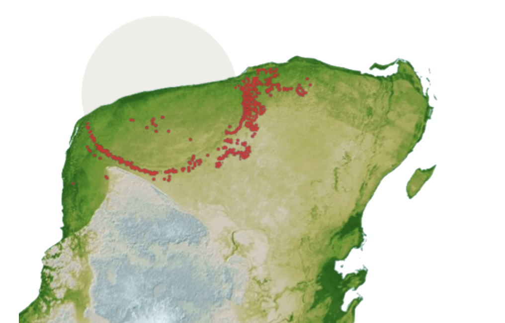

+++
categories = ['Category']
tags = ['Travel']
title = 'Two extraordinary places to visit on Earth!'
date = 2023-10-25T20:51:11+02:00
draft = false
+++

If you are a child of science, this blog will enlighten you about two unconventional destinations which can give an unforgettable experience on visit (perhaps a goosebump too!)

### Gran Sasso National Laboratory(LNGS) in the Italian alps
LNGS is one of Italy’s four National Institutes for Nuclear Physics. LNGS is renowned for its research on particle physics, astrophysics, and other scientific disciplines. Located amidst the beauty of Italian alps and merely 3 to 3.5 hours by road from the city of Rome, this lab is one of the places on earth where the hunt for dark matter is ongoing!

For those who don’t know what dark matter is, it is matter itself (anything that occupies space and has mass) but is invisible unlike the matter that we know of. Dark matter constitutes 85% of the matter in our universe and its invisibility is due to its lack of interaction with light or any other form of electromagnetic waves (dark matter like to flirt with only gravity guys!). This makes it difficult for us, the humans to see or measure them with our state of the art technologies). So better understanding of dark matter helps us with better understanding of our universe, about its composition, the formation of galaxies, about the big bang and the cosmic evolution and more. But most importantly, it will give us exposure to new particles that are unknown to science today. Technological advancement of our species will be unstoppable once we catch this big fish!

Beware that dark matter is hypothetical today. Meaning, it is just a theory and its existence can be confirmed only if we have observations and measurements proving its existence. For this very reason, in Italy LNGS tries to detect dark matter through direct detection experiments. Direct detection experiments are designed to detect the rare interactions between dark matter particles and ordinary matter (atomic nuclei such as that of Sodium Iodide crystal for example). So if a dark matter particle hits a sodium iodide crystal, it may transfer some of its energy to Sodium atom and this creates a flash of light and which can be measured.

LNGS’s dark matter detector is called Data/Libra and it has been operational for past 20 years. What is amazing is that it has detected a peak signal every year in the month of June and a valley in the signal in November. This could technically be the first direct evidence of dark matter. But since scientists are unaware of the influence of other factors on the measurement such as that of temperature and location of the lab, they set up another lab in Australia which is ready to collect data this year. If this new detector also reports a similar signal, it would be official: we have detected dark matter! Prost to science! The day this news breaks out, you could be happy about your visit at the very facility that conducted the whole experiment!

###### LNGS Lab. Source: LNGS

###### Dark matter. Source LNGS

### Yucatan Peninsula
Around 66 million years ago an asteroid hit earth and most of earths flora and fauna perished on the impact causing uncountable immediate and long term effects. This impact event came to be called as Cretaceous-Paleogene (K-Pg) extinction event also belived to have caused the extinction of dinosaurs. The impact have occurred in the Yucatan Peninsula of Mexico. The crater that it created is called as the Chicxulub crater which is around 120 km wide.

###### Impact site and Chicxulub crater. Source: Dr. Emiliano Monroy-Ríos, northwestern university

This extinction event marks a significant turning point in Earth’s history and paved the way for the rise of new forms of life and the dominance of mammals including us in the following geological era. Wouldn’t it be fascinating to stand on the site which was a pivot point for our existence and the extinction of the largest land dwelling animal to have ever lived on our planet? RIP Dinos! I know we dig your bones and fossil out from time to time but still.. even if you are gone, you are not forgotten!

The crater is buried beneath the surface of earth and extends into the surrounding Gulf of Mexico near Yucatan Peninsula. Therefore, the crater itself is not visible on earths surface. But there are geological sites and educational programs which helps us experience the history and science of this place. In the areas around the town of Chicxulub Puerto there are locations where we can learn more about the impact and its geological significance. The Ring of Cenotes in the Yucatan Peninsula is one of such geological sites which is a collection of sinkholes formed as a aftermath of the impact. Scuba diving to the cenotes is also possible here which is different and more challenging than a usual underwater diving.

###### The “Ring of Cenotes” (collection of red dots). Source: Dr. Emiliano Monroy-Ríos, northwestern university

###### One of the sinkholes of the Ring of Cenotes Photo by Laura LaBrie on Unsplash

_I would like to thank Dr. Emiliano Monroy-Ríos for his contributions to the field of geology of Yucatan Peninsula and for his kind gesture of allowing me to use the images from his work for my blog. For those of you who would like to delve more into the geology and science of Yucatan Peninsula, here is the link to his work:_
https://sites.northwestern.edu/monroyrios/ 
